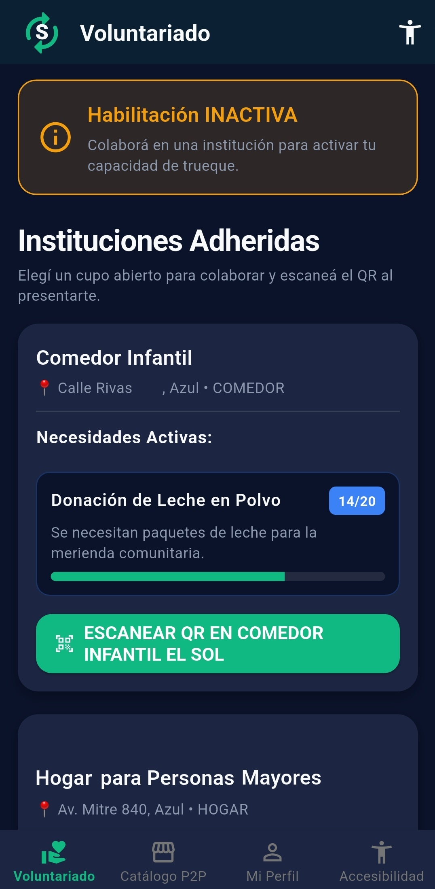
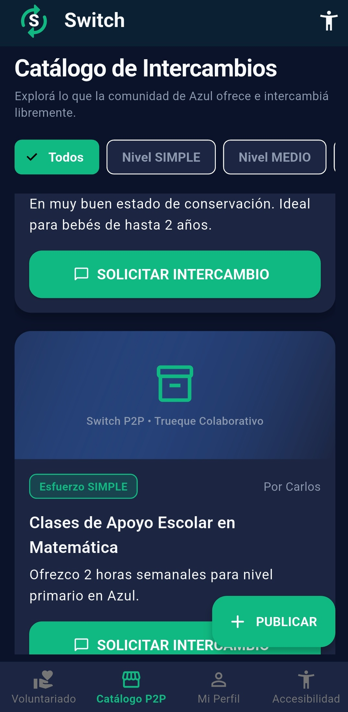
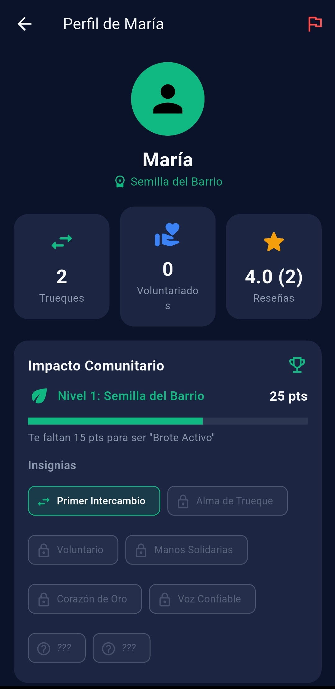
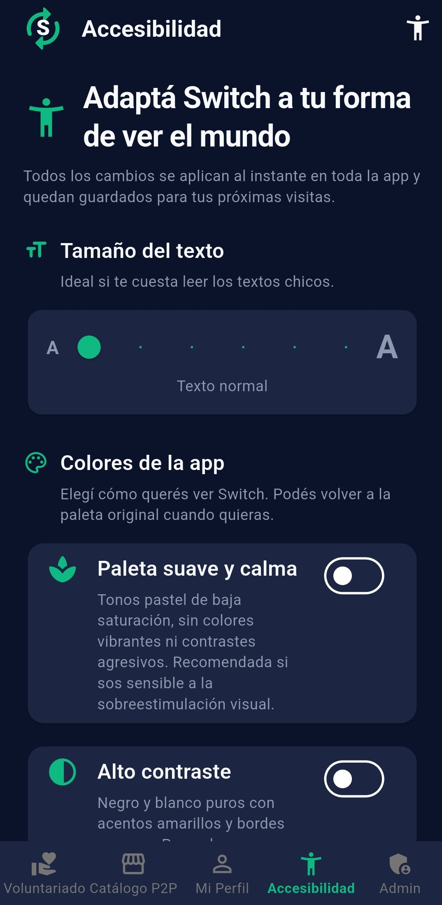
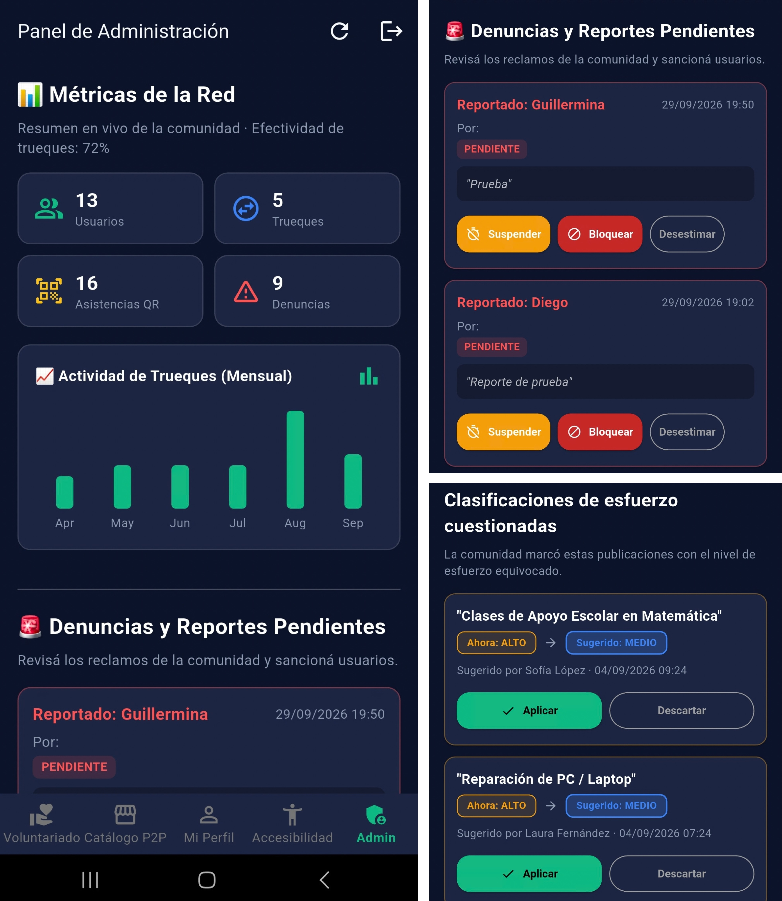

# Switch — Red de Trueques y Voluntariado Comunitario

Switch es una plataforma que conecta a los vecinos de una ciudad con las instituciones comunitarias de su comunidad y les permite intercambiar objetos y servicios entre pares (P2P). La app premia la participación real: cada trueque completado o voluntariado verificado genera **Impacto Comunitario** (niveles, puntos e insignias) que mejora la reputación del vecino y la visibilidad de sus publicaciones.

<p align="center">
  
</p>

---

## 📸  Capturas de la app

| Voluntariado | Catálogo P2P | Perfil e insignias |
|:---:|:---:|:---:|
|  |  |  |

| Accesibilidad | Panel admin | Panel chat | 
|:---:|:---:|:---:|
|  |  |  |

---

## Tecnologías

| Capa | Tecnología |
|---|---|
| App móvil | Flutter (Dart)|
| Backend | Node.js + Express (API REST) |
| Base de datos | PostgreSQL |
| Autenticación | JWT (JSON Web Tokens) + bcrypt |
| Archivos | Multer (subida de imágenes) |
| QR / Geolocalización | `mobile_scanner`, `geolocator`, `qrcode` |
| Gráficos | `fl_chart` (dashboard admin) |

## Funcionalidades principales

- **Voluntariado verificado**: las instituciones publican sus necesidades con prioridad (General / Prioritaria / Urgente). El vecino coordina por chat, se presenta y **escanea el QR físico de la institución** para activar su *Nexo Social*.
- **Vigencia inteligente del Nexo Social**: los días de validez se calculan según la urgencia de la necesidad (General 45 / Prioritaria 75 / Urgente 105 días base; 60 si la visita no apunta a una necesidad concreta), el esfuerzo estimado de la tarea (Medio +15 / Alto +30) y el nivel comunitario del voluntario (nivel 3 +30, 4 +60, 5 +120).
- **Catálogo P2P**: publicación de objetos y servicios con **clasificación automática de esfuerzo** (el backend analiza título y descripción), búsqueda, filtros y propuestas de trueque multi-ítem.
- **Gamificación**: niveles de comunidad — *Semilla del Barrio → Brote Activo → Vecino Confiable → Motor Solidario → Pilar de la Comunidad* — con puntos e insignias, incluidas **insignias secretas**.
- **Recompensas de comunidad**: las publicaciones de vecinos nivel 4+ se destacan en el catálogo.
- **Chat integrado** entre vecinos y con instituciones, sistema de reportes y reseñas.
- **Panel de administración**: métricas de la red (usuarios activos, trueques del mes, voluntariados QR, tasa de eficacia), moderación de reportes (desestimar, suspender, dar de baja) y gestión de **sugerencias de esfuerzo** que la comunidad reporta cuando el nivel estimado de una publicación no coincide con la realidad.
- **Accesibilidad**: 4 paletas temáticas — estándar, vista accesible (texto grande), alto contraste y paleta suave (baja estimulación sensorial) — con factores dinámicos de texto e iconos.

---

## Arquitectura

App Flutter → capa de servicios Dart (`ApiService`) → API REST Express (`/api`) → controladores → modelos → PostgreSQL.

El detalle (diagrama de contexto, casos de uso y modelo entidad-relación con las 10 tablas) está en [`diagramas_mermaid_srs.md`](diagramas_mermaid_srs.md).

## Diagrama de clases (backend)

```mermaid
classDiagram
    direction LR

    class AuthController {
        +registrarUsuario(req, res)
        +loginUsuario(req, res)
    }
    class AuthService {
        +generarToken(usuario) String
        +verificarToken(token) Payload
    }
    class InstController {
        +listarInstituciones(req, res)
        +obtenerCuposAbiertos(req, res)
        +validarPresenciaQR(req, res)
        +registrarInstitucion(req, res)
    }
    class P2PController {
        +listarCatalogoP2P(req, res)
        +listarMisPublicaciones(req, res)
        +previsualizarEsfuerzo(req, res)
        +subirImagen(req, res)
        +crearPublicacionP2P(req, res)
    }
    class IntercambioController {
        +proponerIntercambio(req, res)
        +listarMisPropuestas(req, res)
        +responderPropuesta(req, res)
        +confirmarTrueque(req, res)
    }
    class ChatController {
        +obtenerMensajes(req, res)
        +enviarMensaje(req, res)
    }
    class SugerenciaController {
        +sugerirEsfuerzo(req, res)
        +listarSugerencias(req, res)
        +aplicarSugerencia(req, res)
        +descartarSugerencia(req, res)
    }
    class ReporteController {
        +reportarUsuario(req, res)
        +listarReportes(req, res)
        +desestimarReporte(req, res)
        +darDeBajaUsuario(req, res)
        +suspenderUsuario(req, res)
    }
    class UsuarioController {
        +obtenerMiPerfil(req, res)
    }
    class AdminController {
        +obtenerEstadisticasAdmin(req, res)
    }

    class UsuarioModel {
        +crear(datos)
        +buscarPorDni(dni)
        +buscarPorDniOTelefono(dni, telefono)
        +obtenerPerfilConEstadisticas(id)
        +obtenerNombrePorId(id)
        +suspender(id, dias)
        +levantarSuspension(id)
        +darDeBaja(id)
    }
    class InstitucionModel {
        +obtenerTodas()
        +obtenerPorId(id)
        +obtenerPorQrHash(hash)
        +crearConNecesidades(datos)
    }
    class P2PModel {
        +obtenerCatalogoDisponible(filtros)
        +obtenerPorIds(ids)
        +obtenerPublicacionesDeUsuario(id)
        +crearPublicacion(datos)
    }
    class IntercambioModel {
        +crear(datos)
        +obtenerPorId(id)
        +listarPorUsuario(id)
        +responder(id, aceptada)
        +confirmar(id, usuarioId)
    }
    class VoluntariadoModel {
        +registrarNexoSocial(datos) Vigencia
        +verificarNexoSocialActivo(usuarioId)
        +obtenerCuposPorInstitucion(id)
    }
    class ChatModel {
        +crearMensaje(datos)
        +obtenerConversacion(emisorId, receptorId)
    }
    class ResenaModel {
        +crear(datos)
    }
    class ReporteModel {
        +crear(datos)
        +obtenerTodos()
        +actualizarEstado(id, estado)
    }
    class SugerenciaModel {
        +sugerir(datos)
        +listarPendientes()
        +aplicar(id)
        +descartar(id)
    }
    class AdminModel {
        +obtenerMetricasGlobales()
    }

    class Gamificacion {
        +calcularImpacto(estadisticas) Impacto
        +calcularBonus(estadisticas) Number
        +NIVELES[]
        +INSIGNIAS[]
    }
    class AuthMiddleware {
        +requerirSesion(req, res, next)
        +requerirAdmin(req, res, next)
    }
    class ClasificadorEsfuerzo {
        +clasificar(titulo, descripcion, tipo)
    }
```



Los nombres y métodos reflejan los `module.exports` reales de `backend/src/controllers/` y `backend/src/models/`. Nota: `requerirSesion` y `requerirAdmin` viven en `backend/src/middlewares/auth.js`, no en un controller.

Los controladores son finos: validan entrada y delegan en los modelos, que encapsulan todo el SQL. Los middlewares atraviesan todas las capas: `auth.js` protege rutas con JWT, `errorHandler.js` centraliza errores, `asyncWrapper.js` evita try/catch repetidos.

---

## Puesta en marcha

### Requisitos

- Node.js 18+
- PostgreSQL 14+
- Flutter SDK 3.x
- Un teléfono/emulador Android (para cámara y GPS)

### 1. Base de datos

```bash
psql -U postgres -c "CREATE DATABASE switch_db;"
psql -U postgres -d switch_db -f schema.sql
psql -U postgres -d switch_db -f seed.sql
```

### 2. Backend

Crear `backend/.env` (ver valores de ejemplo en la sección siguiente) y luego:

```bash
cd backend
npm install
npm run dev     # o: npm start
```

Variables de entorno:

```env
PORT=3000
NODE_ENV=development
DB_USER=postgres
DB_PASSWORD=tu_contraseña
DB_HOST=localhost
DB_PORT=5432
DB_NAME=switch_db
JWT_SECRET=una_clave_larga_y_secreta
GPS_VALIDACION_ACTIVA=false   # true = exige estar a menos de 200m al escanear el QR
```

### 3. Frontend

```bash
cd frontend
flutter pub get
flutter run
```

> ⚠️ Si probás en un teléfono físico, cambiá la IP del servidor en `lib/services/api_service.dart` por la IP local de tu PC (ej: `http://192.168.0.X:3000`).

### 4. Códigos QR de las instituciones

Para generar los QR imprimibles de las instituciones cargadas en el seed:

```bash
cd backend
npm install qrcode
node scripts/generarQrs.js   # guarda los PNG en backend/qrs_instituciones/
```

### 5. Pruebas

Las pruebas son de widget (`flutter_test`) y no necesitan backend: interceptan el HTTP con `HttpOverrides` y fakean las respuestas de la API.

```bash
cd frontend
flutter test        # 12 pruebas
flutter analyze     # 0 errores, 0 warnings
```

| Archivo | Qué cubre |
|---|---|
| `test/accesibilidad_test.dart` | Navegación a Accesibilidad y uso de sus controles (escala, paletas). |
| `test/admin_login_dialog_test.dart` | Diálogo de acceso administrativo con tema oscuro, paleta suave y teclado. |
| `test/admin_dashboard_repro_test.dart` | Panel admin con datos reales: evita `BoxConstraints forces an infinite width` y desbordes de `Row` a **384 dp** (la resolución lógica de un teléfono común) con los 4 temas y escala de texto 1.0 y 1.5. |
| `test/admin_flow_repro_test.dart` | Flujo completo sobre `SwitchApp` real: login de vecino, paletas, escala 1.5 y teclado sin desbordes. |

## Usuarios del seed

Todos los vecinos y delegados del seed comparten la contraseña `clave123`; el administrador tiene la suya.

| ID | Rol | DNI | Nombre | Contraseña |
|---|---|---|---|---|
| 1 | Vecina (nivel 2) | `38450912` | Guillermina Valdez | `clave123` |
| 2 | Vecino | `35123456` | Carlos Rodríguez | `clave123` |
| 3 | Delegada | `28999888` | María Gómez | `clave123` |
| 4 | Administrador | `11111111` | Admin Switch | `Switch2024!` |
| 5 | Vecina | `31222444` | Laura Fernández | `clave123` |
| 6 | Vecino | `27333455` | Diego Martínez | `clave123` |
| 7 | Delegada | `29888777` | Sofía López | `clave123` |
| 8 | Vecino | `33555666` | Martín Pérez | `clave123` |
| 9 | Vecina | `34119988` | Valentina Sosa | `clave123` |
| 10 | Vecino | `30888999` | Joaquín Romero | `clave123` |
| 11 | Vecina | `35555667` | Camila Díaz | `clave123` |
| 12 | Delegado | `31888999` | Nicolás Álvarez | `clave123` |

Los hashes QR de las instituciones del seed están en `seed.sql`.

## Estructura del proyecto

```
switch/
├── backend/
│   ├── src/
│   │   ├── config/          # Conexión a PostgreSQL
│   │   ├── controllers/     # Capa HTTP (auth, instituciones, P2P, intercambio, chat, reportes, admin…)
│   │   ├── middlewares/     # JWT, manejo de errores, asyncWrapper
│   │   ├── models/          # Acceso a datos (SQL)
│   │   ├── routes/          # Definición de endpoints /api (index.js)
│   │   ├── services/        # Lógica de tokens
│   │   └── utils/           # Gamificación, clasificador de esfuerzo, geo, errores
│   ├── scripts/generarQrs.js
│   ├── qrs_instituciones/   # PNG de los QR de presencia
│   ├── qrs_print.html       # Hoja imprimible con los QR
│   └── uploads/             # Imágenes publicadas
├── frontend/
│   ├── lib/
│   │   ├── screens/         # Pantallas (voluntariado, catálogo, perfil, chat, admin…)
│   │   ├── services/        # Consumo de la API y sensores (QR, GPS)
│   │   ├── theme/           # Paletas y accesibilidad visual
│   │   ├── widgets/         # Componentes reutilizables (gráficos, logo)
│   │   └── main.dart
│   └── test/                # Pruebas de widget (12)
├── docs/screenshots/        # Capturas usadas en el README
├── schema.sql               # DDL completo (10 tablas)
├── seed.sql                 # Datos de ejemplo
└── diagramas_mermaid_srs.md # UML completo del sistema
```

## Documentación adicional

- [Diagramas Mermaid](diagramas_mermaid_srs.md): diagrama de contexto, casos de uso agrupados por funcionalidad y modelo entidad-relación.
