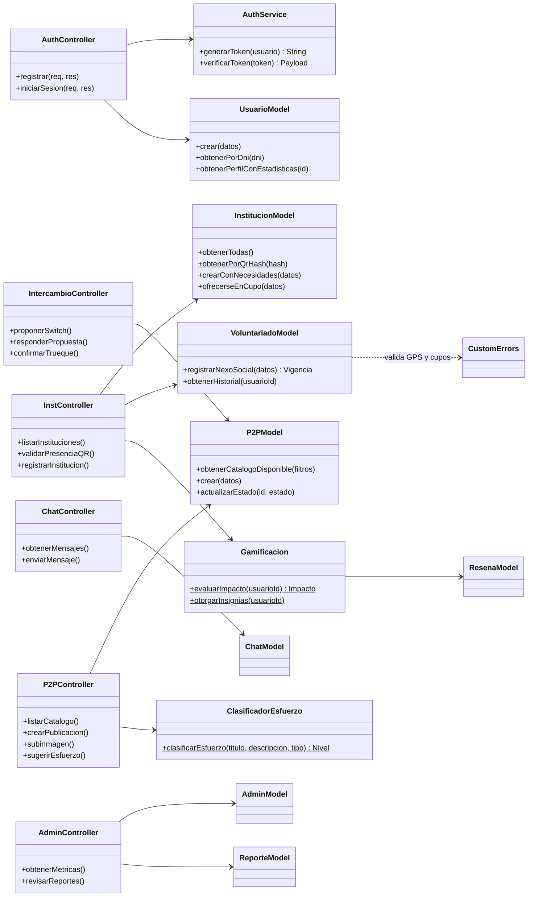

# Switch — Red de Trueques y Voluntariado Comunitario

Switch es una plataforma que conecta a los vecinos de una ciudad con las instituciones comunitarias de su comunidad y les permite intercambiar objetos y servicios entre pares (P2P). La app premia la participación real: cada trueque completado o voluntariado verificado genera **Impacto Comunitario** (niveles, puntos e insignias) que mejora la reputación del vecino y la visibilidad de sus publicaciones.

<p align="center">
  
</p>

---

## 📸  Capturas de la app

| Voluntariado | Catálogo P2P | Perfil e insignias |
|:---:|:---:|:---:|
|  |  |  |

| Chat | Accesibilidad | Panel de administrador |
|:---:|:---:|:---:|
|  |  |  |

---

## Tecnologías

| Capa | Tecnología |
|---|---|
| App móvil | Flutter (Dart), Material 3 |
| Backend | Node.js + Express (API REST) |
| Base de datos | PostgreSQL |
| Autenticación | JWT (JSON Web Tokens) + bcrypt |
| Archivos | Multer (subida de imágenes) |
| QR / Geolocalización | `mobile_scanner`, `geolocator`, `qrcode` |
| Gráficos | `fl_chart` (dashboard admin) |

## Funcionalidades principales

- **Voluntariado verificado**: las instituciones publican sus necesidades con prioridad (General / Prioritaria / Urgente). El vecino coordina por chat, se presenta y **escanea el QR físico de la institución** para activar su *Nexo Social*.
- **Vigencia inteligente del Nexo Social**: los días de validez se calculan según la urgencia de la necesidad (45/75/105 días base), el esfuerzo estimado de la tarea (+15/+30) y el nivel comunitario del voluntario (+30/+60/+120).
- **Catálogo P2P**: publicación de objetos y servicios con **clasificación automática de esfuerzo** (el backend analiza título y descripción), búsqueda, filtros y propuestas de trueque multi-ítem.
- **Gamificación**: niveles de comunidad — *Semilla del Barrio → Brote Activo → Vecino Confiable → Motor Solidario → Pilar de la Comunidad* — con puntos e insignias, incluidas **insignias secretas** (Pionero, Madrugador).
- **Recompensas de comunidad**: las publicaciones de vecinos nivel 4+ se destacan en el catálogo.
- **Chat integrado** entre vecinos y con instituciones, sistema de reportes y reseñas.
- **Panel de administración**: métricas, moderación de reportes y gestión de publicaciones.
- **Accesibilidad**: 4 paletas temáticas — estándar, vista accesible (texto grande), alto contraste y paleta suave (baja estimulación sensorial) — con factores dinámicos de texto e iconos.

---

## Arquitectura

App Flutter → capa de servicios Dart (`ApiService`) → API REST Express (`/api`) → controladores → modelos → PostgreSQL.

El detalle completo (contexto, contenedores, despliegue, casos de uso, ER, secuencias, estados y mapa de endpoints) está en [`diagramas_mermaid_srs.md`](diagramas_mermaid_srs.md).

## Diagrama de clases (backend)



Los controladores son finos: validan entrada y delegan en los modelos, que encapsulan todo el SQL. Los middlewares (`auth.js` protege rutas con JWT, `errorHandler.js` centraliza errores, `asyncWrapper.js` evita try/catch repetido) atraviesan todas las capas.

---

## Puesta en marcha

### Requisitos

- Node.js 18+
- PostgreSQL 14+
- Flutter SDK 3.x
- Un teléfono/emulador Android (para cámara y GPS)

### 1. Base de datos

```bash
psql -U postgres -c "CREATE DATABASE switch_db;"
psql -U postgres -d switch_db -f schema.sql
psql -U postgres -d switch_db -f seed.sql
```

### 2. Backend

Crear `backend/.env` (ver valores de ejemplo en la sección siguiente) y luego:

```bash
cd backend
npm install
npm run dev     # o: npm start
```

Variables de entorno:

```env
PORT=3000
DB_USER=postgres
DB_PASSWORD=tu_contraseña
DB_HOST=localhost
DB_PORT=5432
DB_NAME=switch_db
JWT_SECRET=una_clave_larga_y_secreta
GPS_VALIDACION_ACTIVA=false   # true = exige estar a menos de 200m al escanear el QR
```

### 3. Frontend

```bash
cd frontend
flutter pub get
flutter run
```

> ⚠️ Si probás en un teléfono físico, cambiá la IP del servidor en `lib/services/api_service.dart` por la IP local de tu PC (ej: `http://192.168.0.X:3000`).

### 4. Códigos QR de las instituciones

Para generar los QR imprimibles de las instituciones cargadas en el seed:

```bash
cd backend
npm install qrcode
node scripts/generarQrs.js   # guarda los PNG en backend/qrs_instituciones/
```

## Usuarios del seed

| Rol | DNI | Contraseña |
|---|---|---|
| Vecina (nivel 3) | `38450912` | `clave123` |
| Vecino | `35123456` | `clave123` |
| Vecina | `28999888` | `clave123` |
| Administrador | `11111111` | `Switch2024!` |

Los hashes QR de las instituciones del seed están en `seed.sql` (ej: `QR_HASH_COMEDOR_ELSOL_2026`).

## Estructura del proyecto

```
App/
├── backend/
│   ├── src/
│   │   ├── config/          # Conexión a PostgreSQL
│   │   ├── controllers/     # Capa HTTP (auth, instituciones, P2P, chat, admin…)
│   │   ├── middlewares/     # JWT, manejo de errores, asyncWrapper
│   │   ├── models/          # Acceso a datos (SQL)
│   │   ├── routes/          # Definición de endpoints /api
│   │   ├── services/        # Lógica de tokens
│   │   └── utils/           # Gamificación, clasificador de esfuerzo, geo, errores
│   ├── scripts/generarQrs.js
│   └── uploads/             # Imágenes publicadas
├── frontend/
│   └── lib/
│       ├── screens/         # Pantallas (voluntariado, catálogo, perfil, chat, admin…)
│       ├── services/        # Consumo de la API y sensores (QR, GPS)
│       ├── theme/           # Paletas y accesibilidad visual
│       └── widgets/         # Componentes reutilizables (gráficos, logo)
├── schema.sql               # DDL completo
├── seed.sql                 # Datos de ejemplo
└── diagramas_mermaid_srs.md # UML completo del sistema
```

## Documentación adicional

- [Diagramas Mermaid del SRS](diagramas_mermaid_srs.md): contexto, contenedores, despliegue, casos de uso, modelo ER, secuencias (login, voluntariado con QR, trueque P2P, chat/moderación), máquinas de estados y mapa completo de endpoints REST.
