# Diagramas Mermaid del sistema Switch

Este documento contiene diagramas listos para incorporar al SRS. La implementacion actual esta compuesta por una aplicacion Flutter, una API REST Node.js/Express y PostgreSQL. Los endpoints de chat, reportes y propuestas de switch se mantienen actualmente en memoria dentro del servidor.

## 1. Diagrama de contexto del sistema

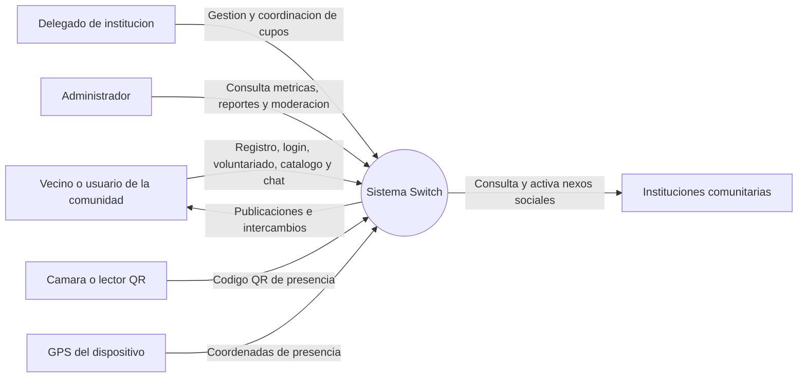

## 2. Diagrama de contenedores / arquitectura logica

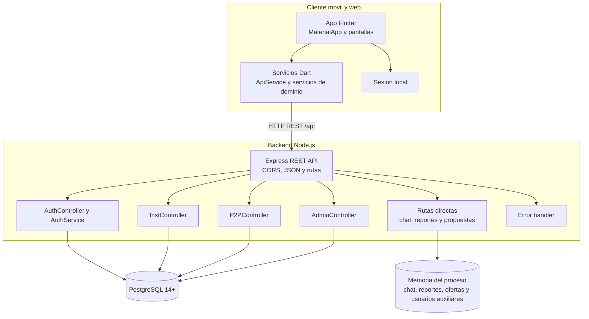

## 3. Diagrama de despliegue

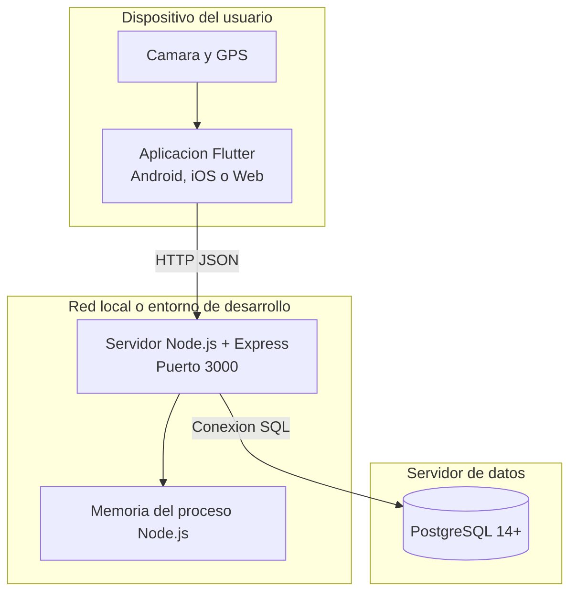

## 4. Casos de uso principales

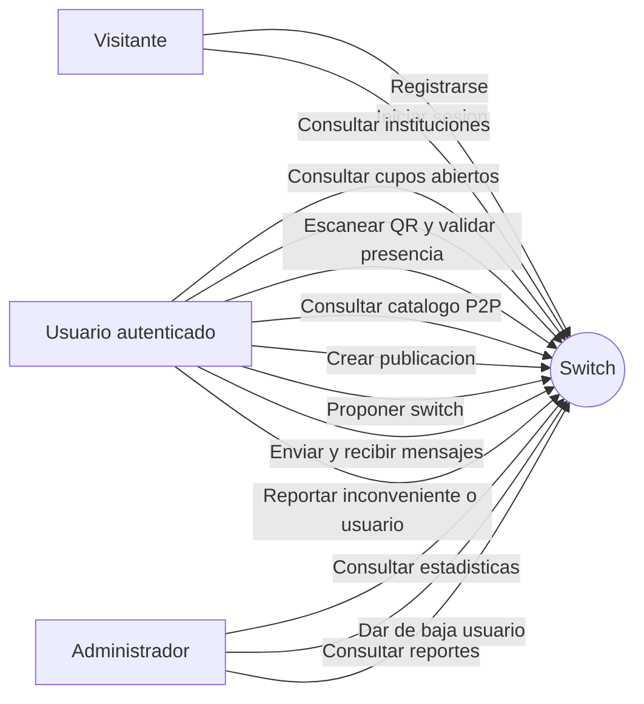

## 5. Modelo entidad-relacion

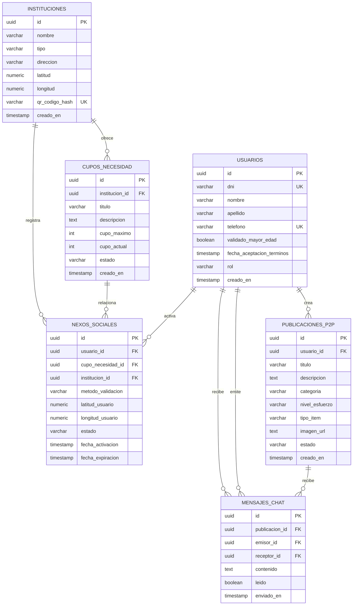

## 6. Secuencia: registro e inicio de sesion

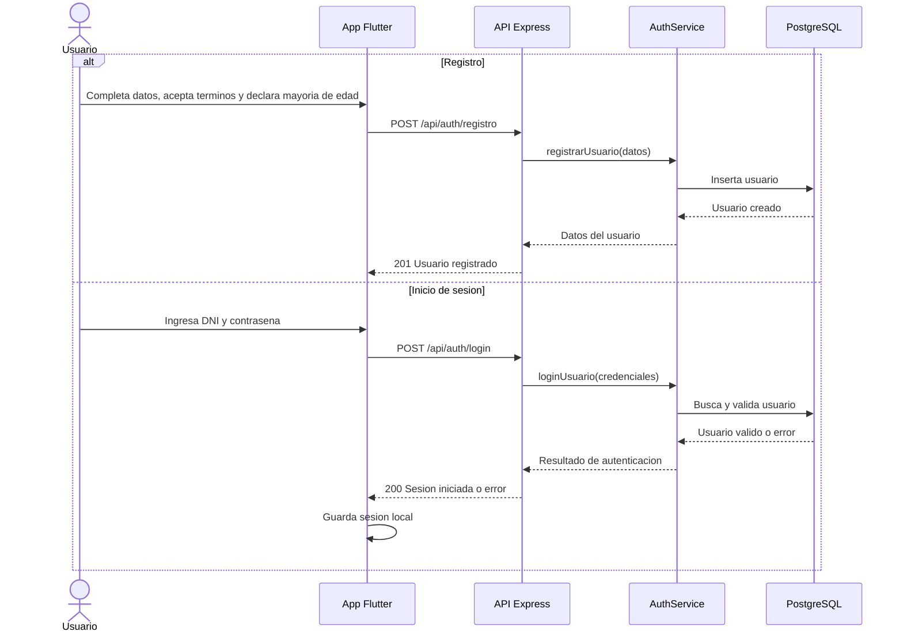

## 7. Secuencia: voluntariado, QR y nexo social

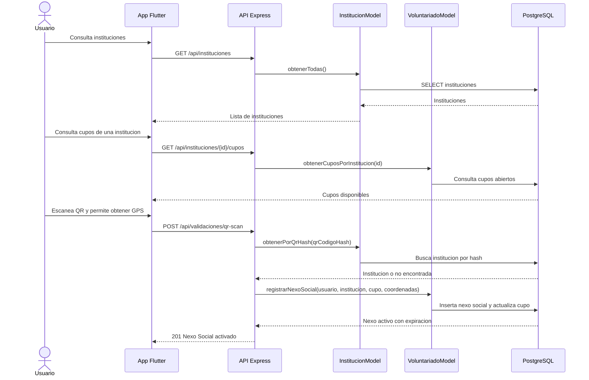

## 8. Secuencia: catalogo P2P y propuesta de switch

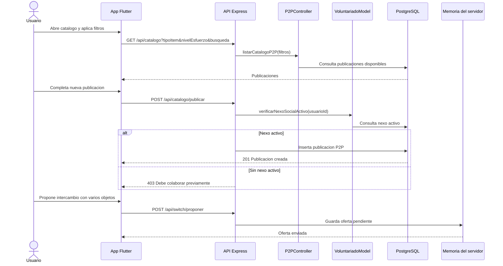

## 9. Secuencia: chat y moderacion

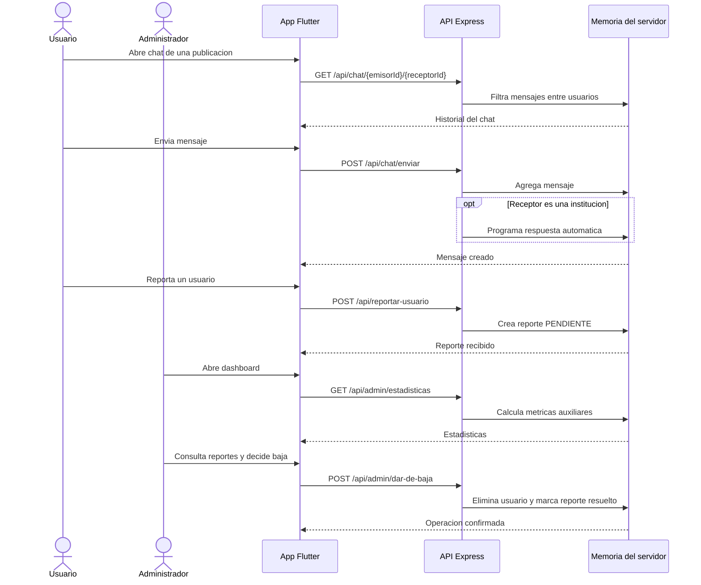

## 10. Estados de una publicacion P2P

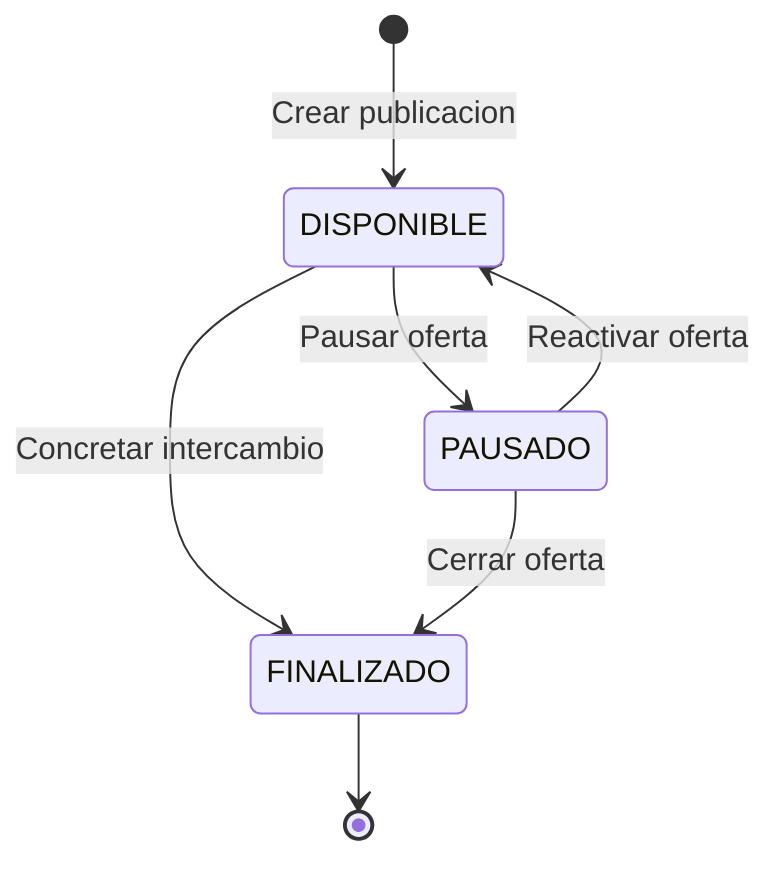

## 11. Estados del nexo social

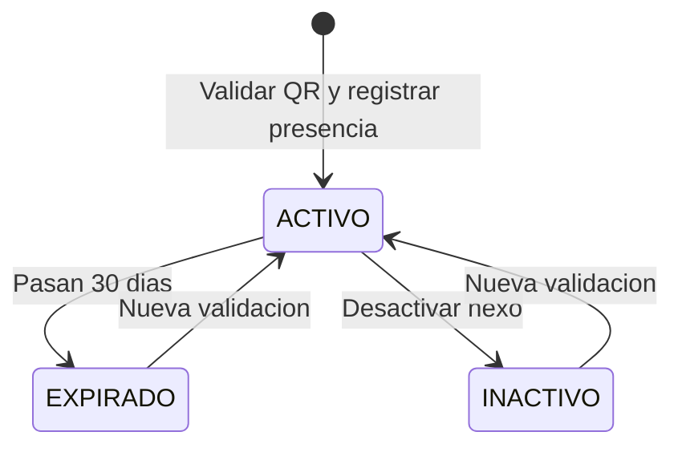

## 12. Mapa de endpoints REST actuales

| Metodo | Endpoint | Responsabilidad | Persistencia actual |
|---|---|---|---|
| POST | `/api/auth/registro` | Registrar usuario | PostgreSQL |
| POST | `/api/auth/login` | Autenticar usuario | PostgreSQL |
| GET | `/api/instituciones` | Listar instituciones | PostgreSQL |
| GET | `/api/instituciones/{id}/cupos` | Listar cupos abiertos | PostgreSQL |
| POST | `/api/validaciones/qr-scan` | Activar nexo social | PostgreSQL |
| GET | `/api/catalogo` | Consultar publicaciones | PostgreSQL |
| POST | `/api/catalogo/publicar` | Crear publicacion P2P | PostgreSQL |
| GET | `/api/chat/{emisorId}/{receptorId}` | Obtener mensajes | Memoria del servidor |
| POST | `/api/chat/enviar` | Enviar mensaje | Memoria del servidor |
| POST | `/api/switch/proponer` | Crear propuesta de intercambio | Memoria del servidor |
| GET | `/api/admin/estadisticas` | Obtener metricas | Mixta, segun controlador |
| GET | `/api/admin/reportes` | Listar reportes | Memoria del servidor |
| POST | `/api/reportar-usuario` | Crear reporte | Memoria del servidor |
| POST | `/api/admin/dar-de-baja` | Dar de baja usuario | Memoria del servidor |

## Observaciones para el SRS

- El modelo SQL define `usuarios`, `instituciones`, `cupos_necesidad`, `nexos_sociales`, `publicaciones_p2p` y `mensajes_chat`.
- El codigo actual usa estructuras en memoria para chat, reportes, propuestas de switch y usuarios auxiliares. El SRS debe describirlas como persistencia temporal mientras no exista una migracion SQL para esas entidades.
- La pantalla Flutter de acceso administrativo contiene credenciales embebidas y el backend no muestra middleware de autenticacion/autorizacion en las rutas. Para produccion, el SRS deberia incluir autenticacion segura, hash de contrasenas, sesiones o JWT y control de roles.
- El diagrama entidad-relacion representa el esquema SQL; no agrega tablas para reportes ni propuestas porque esas tablas no existen en `schema.sql`.
