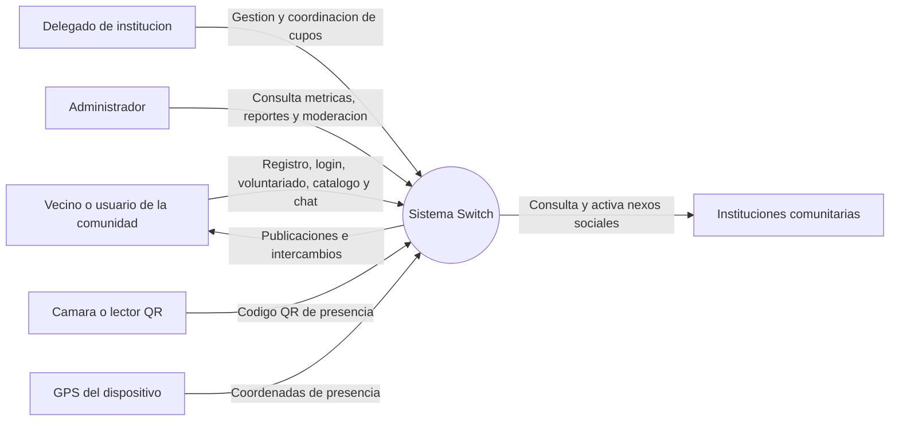

# Diagramas Mermaid del sistema Switch

En este documento se visualizan el diagrama de contexto, los casos de uso y el modelo entidad-relación. La implementación actual es una app Flutter, una API REST Node.js/Express y PostgreSQL. La API expone 28 endpoints bajo /api y protege las rutas privadas con JWT.

## 1. Diagrama de contexto del sistema

## 4. Casos de uso principales

```mermaid
flowchart TB
    visitante(["Visitante"])
    usuario(["Usuario autenticado"])
    admin(["Administrador"])

    subgraph gAcceso["Acceso e instituciones"]
        direction LR
        v1["Registrarse"]
        v2["Iniciar sesión"]
        v3["Registrarse como institución"]
        u1["Consultar instituciones"]
        u2["Consultar cupos abiertos"]
    end

    subgraph gVoluntariado["Voluntariado"]
        direction LR
        u3["Escanear QR<br/>y validar presencia"]
    end

    subgraph gCatalogo["Catálogo e intercambios"]
        direction LR
        c1["Consultar<br/>catálogo P2P"]
        c2["Crear publicación"]
        c3["Sugerir corrección<br/>del nivel de esfuerzo"]
        c4["Proponer intercambio"]
        c5["Responder y confirmar<br/>un trueque"]
    end

    subgraph gComunidad["Comunidad"]
        direction LR
        m1["Enviar y recibir<br/>mensajes"]
        m2["Calificar con una reseña"]
        m3["Consultar perfil,<br/>nivel e insignias"]
        m4["Reportar inconveniente<br/>o usuario"]
    end

    subgraph gAdmin["Administración"]
        direction LR
        a1["Consultar estadísticas"]
        a2["Consultar y resolver<br/>reportes"]
        a3["Suspender o dar de baja<br/>usuario"]
        a4["Aplicar o descartar<br/>sugerencias de esfuerzo"]
    end

    visitante --> v1
    visitante --> v2
    visitante --> v3
    usuario --> u1
    usuario --> u2
    usuario --> u3
    usuario --> c1
    usuario --> c2
    usuario --> c3
    usuario --> c4
    usuario --> c5
    usuario --> m1
    usuario --> m2
    usuario --> m3
    usuario --> m4
    admin --> a1
    admin --> a2
    admin --> a3
    admin --> a4
```

## 5. Modelo entidad-relacion

