# Diagramas Mermaid del sistema Switch

Este documento contiene diagramas listos para incorporar al SRS. La implementacion actual esta compuesta por una aplicacion Flutter, una API REST Node.js/Express y PostgreSQL. **Todo el dominio (chat, reportes, propuestas de intercambio, resenas y sugerencias de esfuerzo) persiste en PostgreSQL**; no hay estructuras en memoria. La API expone 28 endpoints bajo `/api` y protege las rutas privadas con JWT.

## 1. Diagrama de contexto del sistema

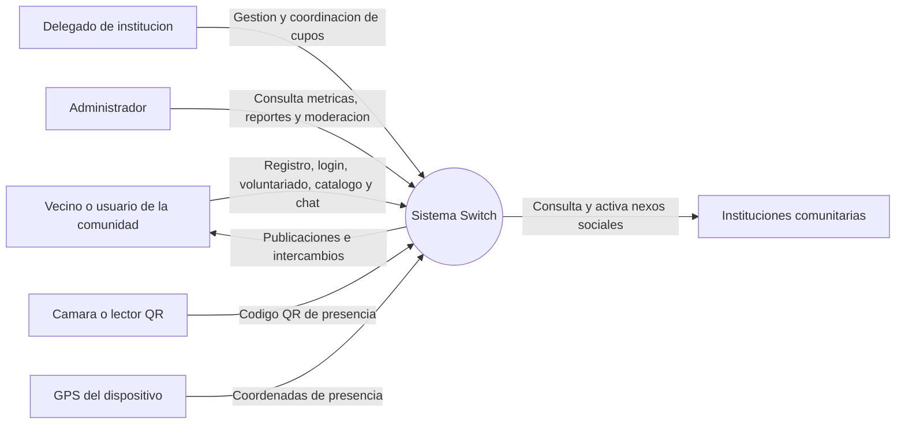

## 2. Diagrama de contenedores / arquitectura logica

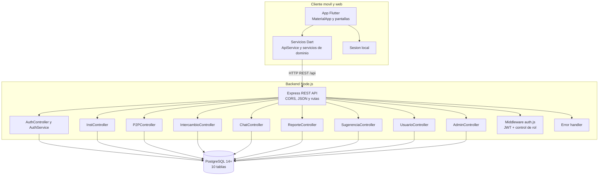

## 3. Diagrama de despliegue

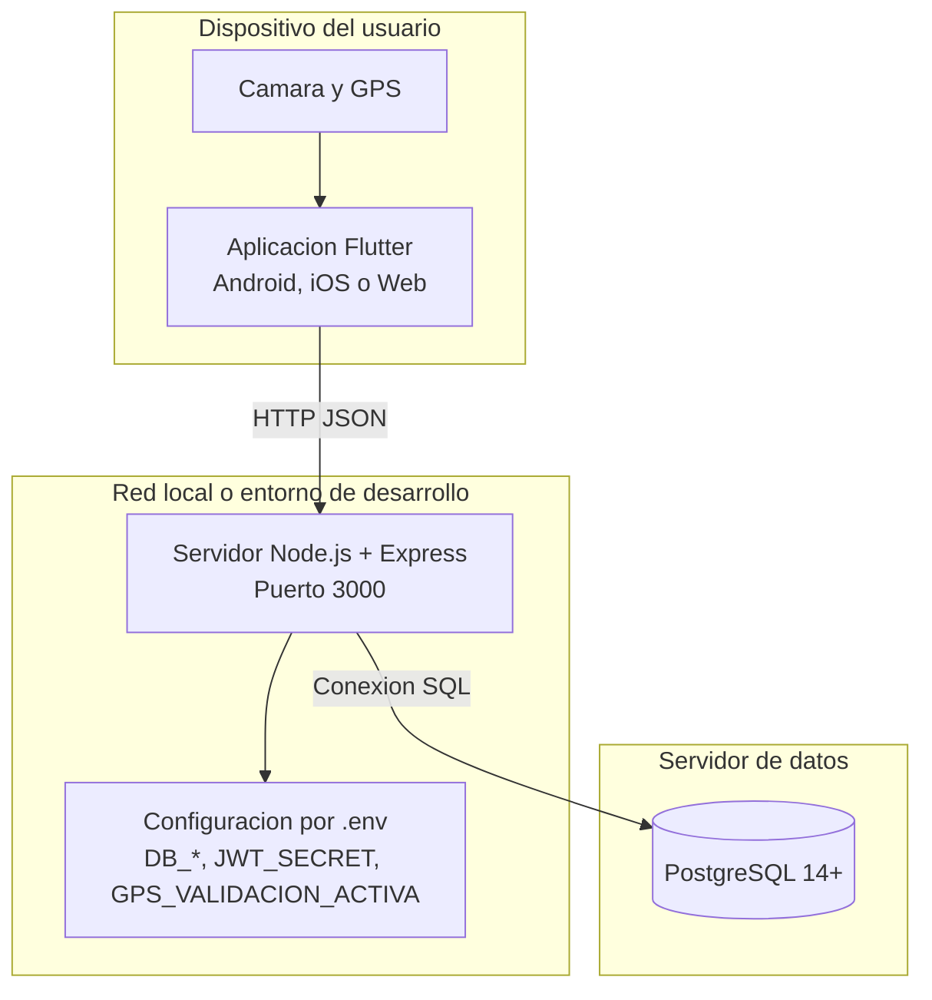

## 4. Casos de uso principales

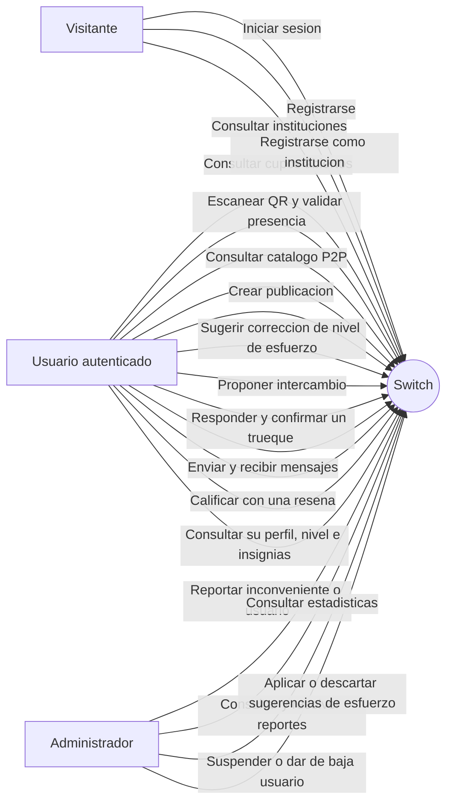

## 5. Modelo entidad-relacion

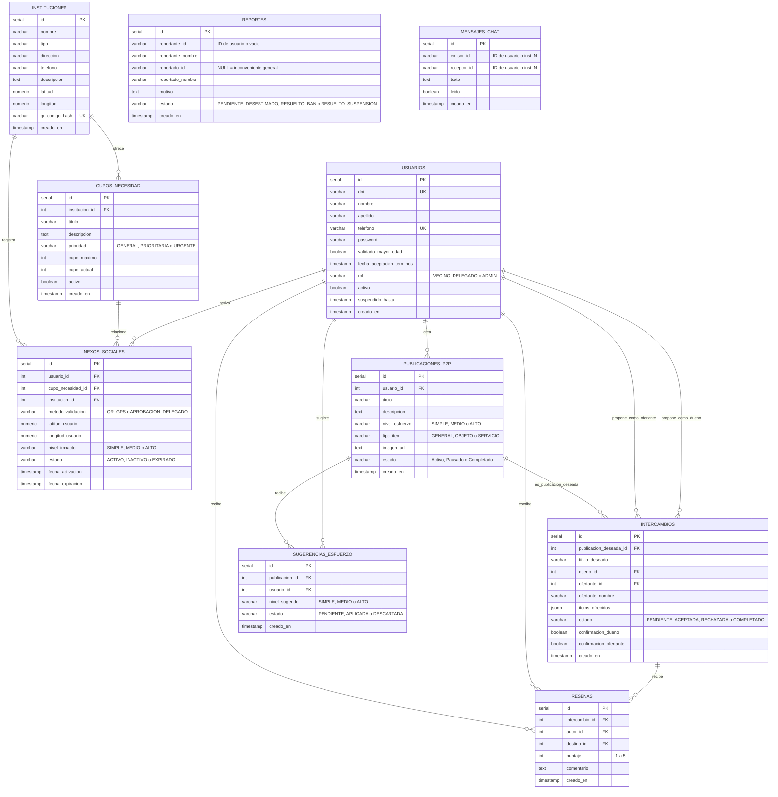

> `mensajes_chat` no tiene clave foranea a propósito: `emisor_id` y `receptor_id` son `VARCHAR` para admitir tanto usuarios (`"1"`) como instituciones (`"inst_1"`). Por eso no participates de la relacion `PUBLICACIONES_P2P ||--o{ MENSAJES_CHAT`. Tampoco hay relacion con `REPORTES`: sus identificadores de usuario se guardan como texto para que un reporte sobreviva al borrado del usuario.

## 6. Secuencia: registro e inicio de sesion

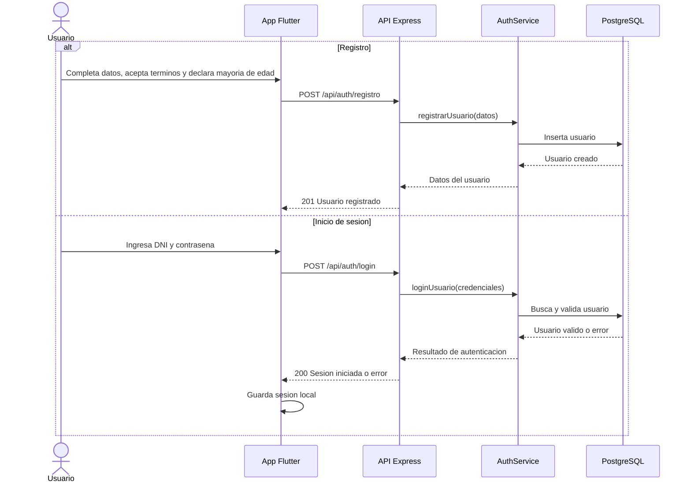

## 7. Secuencia: voluntariado, QR y nexo social

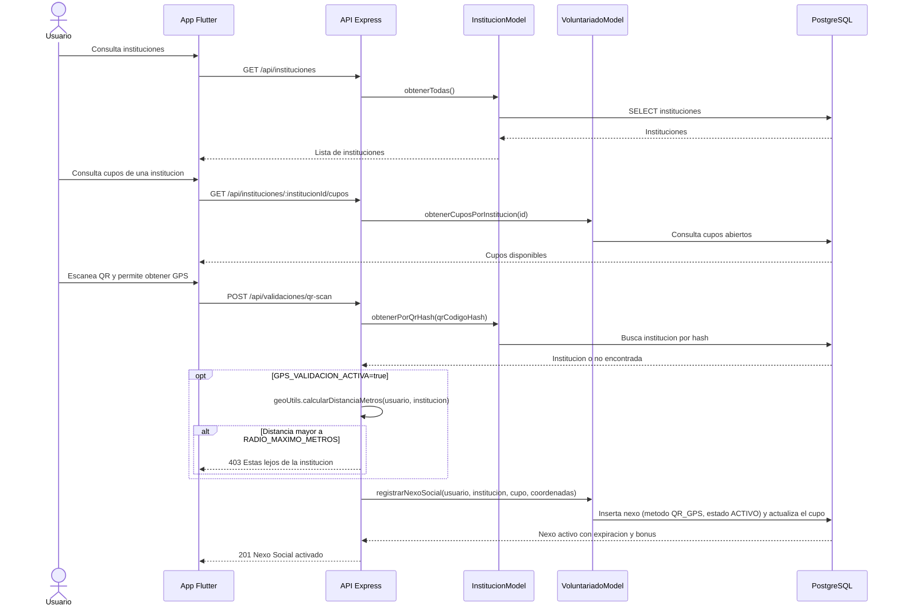

> La validacion por geolocalizacion es **opcional**: solo corre si `GPS_VALIDACION_ACTIVA=true` en el `.env` del backend; si esta apagado o el usuario no envia coordenadas, se omite. El radio maximo sale de `geoUtils` / `RADIO_MAXIMO_METROS`.
>
> El endpoint siempre escribe `metodo_validacion = 'QR_GPS'`. El valor `APROBACION_DELEGADO` esta permitido por el esquema y lo usan 3 filas del seed, pero **ninguna API lo genera hoy**: la aprobacion por delegado no tiene endpoint y queda como funcionalidad pendiente.

## 8. Secuencia: catalogo P2P y propuesta de switch

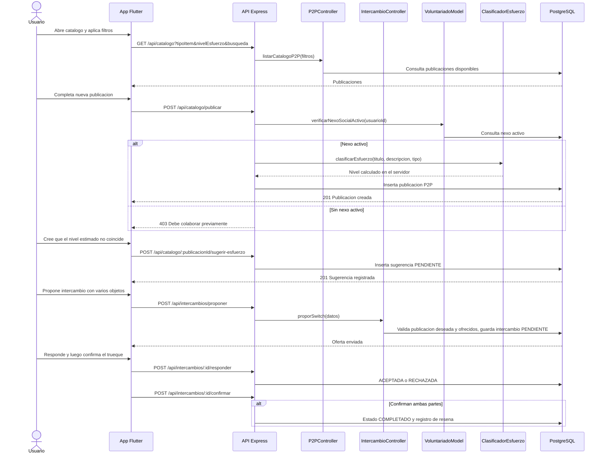

## 9. Secuencia: chat y moderacion

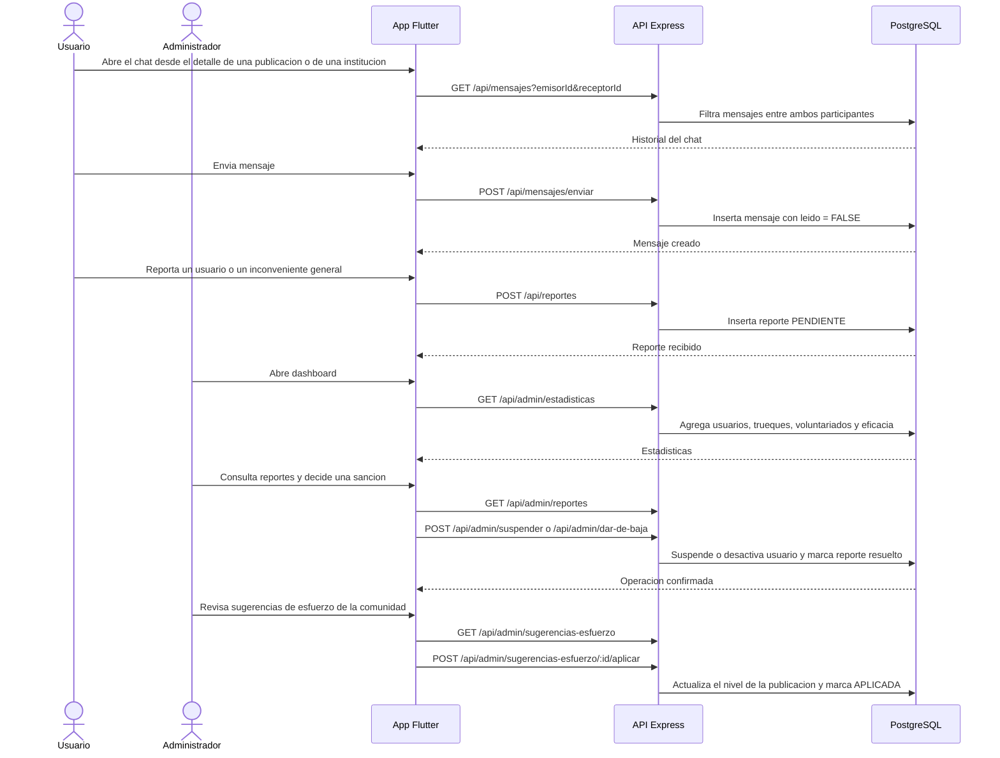

## 10. Estados de una publicacion P2P

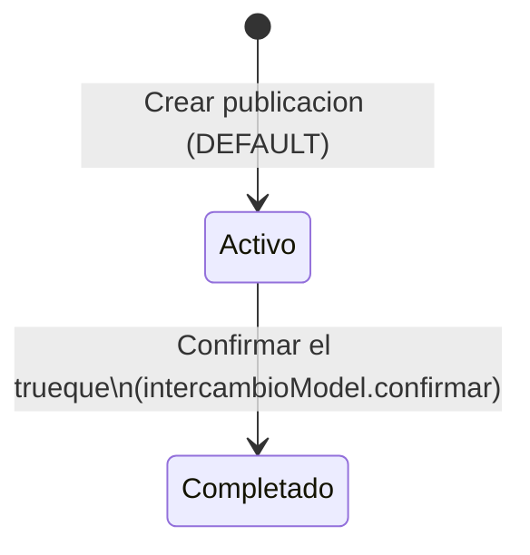

> El comentario de `schema.sql` admite `Activo`, `Pausado` y `Completado`, pero **solo hay una transicion implementada**: el `DEFAULT` es `Activo` al publicar, y `intercambioModel.confirmar()` ejecuta `UPDATE publicaciones_p2p SET estado = 'Completado'`. No existe endpoint ni consulta que ponga `Pausado`, asi que pausar y reactivar una publicacion es functionality pendiente. Notese tambien que esta columna **no tiene `CHECK`**: los tres valores no estan validados por la base (a diferencia de `nexos_sociales`, `reportes`, `intercambios` y `sugerencias_esfuerzo`).

## 11. Estados del nexo social

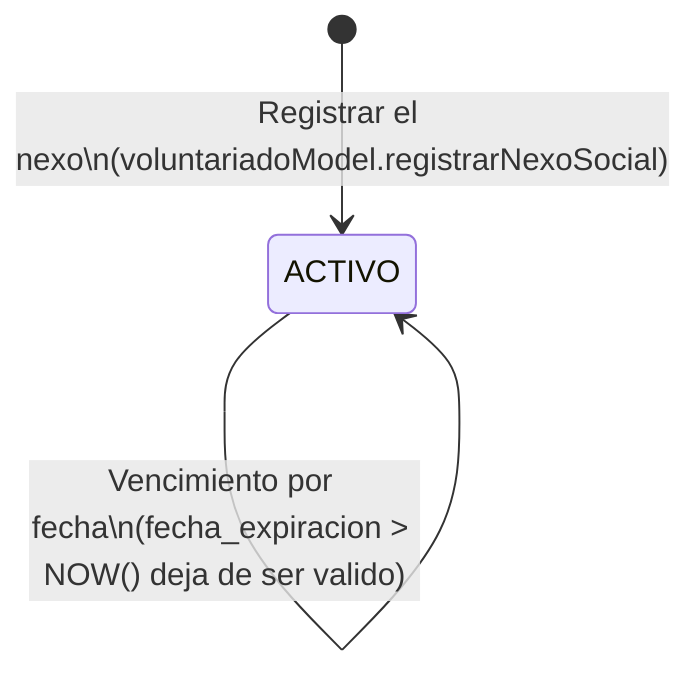

> `schema.sql` define el `CHECK estado IN ('ACTIVO', 'INACTIVO', 'EXPIRADO')`, pero el backend **solo escribe `ACTIVO`** (valor fijo en el `INSERT`). No hay consulta que marque un nexo como `INACTIVO` ni que lo cambie a `EXPIRADO`.
>
> La caducidad no se materializa en la columna `estado`: `verificarNexoSocialActivo()` exige `estado = 'ACTIVO' AND (fecha_expiracion IS NULL OR fecha_expiracion > CURRENT_TIMESTAMP)`. Es decir, un nexo vencido sigue diciendo `ACTIVO` en la base y simplemente deja de contar. Los estados `INACTIVO` y `EXPIRADO` estan disponibles en el esquema pero hoy no se usan.
>
> La vigencia tampoco es un plazo fijo: se calcula al activar el nexo (45 días base para una necesidad General, 75 Prioritaria, 105 Urgente y 60 si la visita no apunta a una necesidad concreta), mas el bonus por esfuerzo de la necesidad (Medio +15, Alto +30) y por nivel comunitario del voluntario (nivel 3 +30, 4 +60, 5 +120).

## 12. Mapa de endpoints REST actuales

Los 28 endpoints definidos en `backend/src/routes/index.js`. Todos persisten en PostgreSQL. La columna de acceso refleja el middleware real de cada ruta.

| Metodo | Endpoint | Responsabilidad | Acceso | Persistencia |
|---|---|---|---|---|
| POST | `/api/auth/registro` | Registrar usuario | Publico | PostgreSQL |
| POST | `/api/auth/login` | Autenticar usuario y emitir JWT | Publico | PostgreSQL |
| GET | `/api/instituciones` | Listar instituciones | Publico | PostgreSQL |
| GET | `/api/instituciones/:institucionId/cupos` | Listar cupos abiertos | Publico | PostgreSQL |
| POST | `/api/instituciones/registro` | Registrar institucion con sus necesidades | Publico | PostgreSQL |
| POST | `/api/validaciones/qr-scan` | Validar QR y activar nexo social | Sesion | PostgreSQL |
| GET | `/api/catalogo` | Consultar publicaciones con filtros | Publico | PostgreSQL |
| GET | `/api/catalogo/mis-publicaciones` | Listar publicaciones propias | Sesion | PostgreSQL |
| POST | `/api/catalogo/clasificar-esfuerzo` | Previsualizar nivel de esfuerzo | Publico | Sin persistir |
| POST | `/api/catalogo/imagen` | Subir imagen de una publicacion (Multer) | Sesion | Filesystem |
| POST | `/api/catalogo/publicar` | Crear publicacion P2P (exige nexo activo) | Sesion | PostgreSQL |
| POST | `/api/catalogo/:publicacionId/sugerir-esfuerzo` | Sugerir correccion del nivel de esfuerzo | Sesion | PostgreSQL |
| GET | `/api/mensajes` | Obtener historial con un receptor | Sesion | PostgreSQL |
| POST | `/api/mensajes/enviar` | Enviar mensaje | Sesion | PostgreSQL |
| POST | `/api/intercambios/proponer` | Crear propuesta de intercambio multi-item | Sesion | PostgreSQL |
| GET | `/api/intercambios/mis-propuestas` | Listar propuestas propias | Sesion | PostgreSQL |
| POST | `/api/intercambios/:id/responder` | Aceptar o rechazar una propuesta | Sesion | PostgreSQL |
| POST | `/api/intercambios/:id/confirmar` | Confirmar trueque y opcionalmente dejar una resena | Sesion | PostgreSQL |
| POST | `/api/reportes` | Reportar usuario o inconveniente general | Sesion | PostgreSQL |
| GET | `/api/usuarios/perfil` | Perfil con nivel, puntos e insignias | Sesion | PostgreSQL |
| GET | `/api/admin/estadisticas` | Metricas de la red | Sesion + Admin | PostgreSQL |
| GET | `/api/admin/reportes` | Listar reportes pendientes | Sesion + Admin | PostgreSQL |
| POST | `/api/admin/reportes/:reporteId/desestimar` | Desestimar un reporte | Sesion + Admin | PostgreSQL |
| POST | `/api/admin/dar-de-baja` | Baja permanente de un usuario | Sesion + Admin | PostgreSQL |
| POST | `/api/admin/suspender` | Suspension temporal por N dias | Sesion + Admin | PostgreSQL |
| GET | `/api/admin/sugerencias-esfuerzo` | Listar sugerencias de esfuerzo | Sesion + Admin | PostgreSQL |
| POST | `/api/admin/sugerencias-esfuerzo/:id/aplicar` | Aplicar la sugerencia al catalogo | Sesion + Admin | PostgreSQL |
| POST | `/api/admin/sugerencias-esfuerzo/:id/descartar` | Descartar la sugerencia | Sesion + Admin | PostgreSQL |

Leyenda de acceso: **Publico** = sin token; **Sesion** = `requerirSesion` (JWT valido); **Sesion + Admin** = ademas `requerirAdmin` (rol `ADMIN`).

## Observaciones

- `schema.sql` define 10 tablas: `usuarios`, `instituciones`, `cupos_necesidad`, `nexos_sociales`, `publicaciones_p2p`, `mensajes_chat`, `reportes`, `intercambios`, `resenas` y `sugerencias_esfuerzo`. Las claves primarias son `SERIAL` (integers), no UUID.
- **No hay persistencia en memoria**: chat, reportes, intercambios, resenas y sugerencias de esfuerzo estan todos en PostgreSQL. La unica excepcion es la imagen subida con Multer, que va al filesystem (`backend/uploads/`).
- La autenticacion usa **JWT con hash de contrasenas (bcrypt)**: `POST /api/auth/login` devuelve el token y el middleware `auth.js` (`requerirSesion`, `requerirAdmin`) protege el resto. El control de rol se aplica en las 8 rutas `/api/admin/*`.
- La sesion vive en el dispositivo (`SharedPreferences` en Flutter). El login administrativo se valida contra un usuario con rol `ADMIN` del backend: **no hay contrasenas embebidas en la app**.
- `reportes` y `mensajes_chat` guardan los identificadores de usuario como `VARCHAR` y no con clave foranea, a proposito: un reporte debe sobrevivir al borrado del usuario, y el chat admite un interlocutor institucional (`inst_N`) ademas de usuarios.
- `publicaciones_p2p.estado` es la unica columna de estado **sin `CHECK`**: el esquema solo la documenta en un comentario.

## Funcionalidades del esquema que todavia no implementa la API

Diferencias encontradas al contrastar `schema.sql` con el codigo. No son errores, pero conviene no documentarlas como si funcionaran:

| Definido en el esquema | Situacion real |
|---|---|
| `publicaciones_p2p.estado = 'Pausado'` | No hay endpoint ni consulta que pause o reactive una publicacion. Solo se usa `Activo` y `Completado`. |
| `nexos_sociales.estado` `INACTIVO` / `EXPIRADO` | El backend solo inserta `ACTIVO`. La caducidad se evalua por `fecha_expiracion`, sin cambiar la columna. |
| `nexos_sociales.metodo_validacion = 'APROBACION_DELEGADO'` | Ninguna API lo genera: la aprobacion de un delegado no tiene endpoint. |
| `resenas` | Se crea una al confirmar un intercambio, pero no hay endpoint para leer las resenas individuales: solo se consultan como agregados (promedio y cantidad) en el perfil y en el detalle de la publicacion. |
